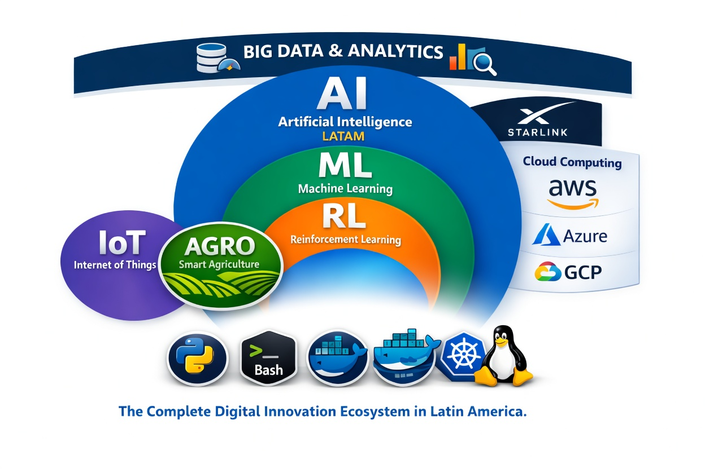

  

# DANIEL NOVAIS // CYBER AGRI-NET OPERATOR

## Building the next-generation digital frontier for connectivity, telecom, and smart agriculture

Technology becomes revolutionary when it reaches the edge of the map.

My work is focused on designing a **complete digital innovation ecosystem** where **IoT**, **Smart Agro**, **Big Data**, **AI**, **ML**, **RL**, **Cloud Computing**, and **Telecom Infrastructure** converge to power intelligent systems for real-world impact. From **Starlink-powered connectivity** to **edge-enabled agriculture**, I build solutions for environments where resilience, signal intelligence, automation, and data-driven decisions are mission-critical.

I explore the fusion of **AWS**, **GCP**, **Azure**, **Python**, **Bash**, **Docker**, **Ubuntu**, and **Linux** to create scalable platforms for rural transformation, operational intelligence, and next-wave infrastructure.

---

## CYBERPUNK VISION // DIGITAL ECOSYSTEM

  

> **The Complete Digital Innovation Ecossystem**  
> Neon networks. Intelligent agriculture. Autonomous infrastructure. Data flowing from the field to the cloud.

---

## CORE DOMAINS

- 🛰️ **Telecom engineering and rural/off-grid connectivity**
- 🌾 **Smart AGRO systems and intelligent field operations**
- 📡 **IoT telemetry, automation, and distributed sensing**
- 🤖 **Artificial Intelligence, Machine Learning, and Reinforcement Learning**
- ☁️ **Cloud-native architecture with AWS, GCP, and Azure**
- 📊 **Big Data analytics for infrastructure and agricultural intelligence**
- 🐧 **Linux-based engineering workflows with Bash, Docker, and Ubuntu**

---

## PRIORITY REPOSITORIES

### [TELECOM-TOWER-POWER](https://github.com/danielnovais-tech/TELECOM-TOWER-POWER)
A Python-based simulation of the engineering core behind a tower intelligence platform, including tower database logic, signal strength estimation, point-to-point analysis, line-of-sight verification, Fresnel zone modeling, and support for 4G/5G bands.

**Highlights:** Python · Telecom simulation · Signal analysis · LOS/Fresnel · SaaS backend prototype

### [Rural Connectivity Mapper 2026](https://github.com/danielnovais-tech/Rural-Connectivity-Mapper-2026)
A strategic mapping and analysis platform for identifying underserved territories and designing data-driven connectivity plans for the rural frontier.

**Highlights:** Python · GIS · Connectivity intelligence · Data visualization

### [Simulador de Arquitetura Híbrida com Edge Computing para Agro Remoto](https://github.com/danielnovais-tech/Simulador-de-Arquitetura-H-brida-com-Edge-Computing-para-Agro-Remoto)
A resilient hybrid architecture simulator focused on cloud-edge operations for remote agriculture, intelligent processing, and mission-ready infrastructure.

**Highlights:** Python · Edge computing · Distributed architecture · Resilience engineering

### [AgriX Boost 2026](https://github.com/danielnovais-tech/AgriX-Boost-2026)
An applied intelligence project for crop analytics, precision agriculture, automation workflows, and accessible AI for field-scale optimization.

**Highlights:** Python · AI/ML · Precision agriculture · IoT workflows

---

## OPERATOR PROFILE

- 🎓 Undergraduate Student at **UniCEUB – Centro Universitário de Brasília**
- 🌐 Open source developer building the intersection of **telecom, AI, cloud, and smart agriculture**
- 🚀 Exploring **Starlink**, **edge computing**, **telemetry**, and **digital inclusion** for high-impact environments
- ⚡ Focused on turning futuristic engineering into practical infrastructure

---

## MISSION PROTOCOL

To architect systems that connect remote realities to intelligent digital infrastructure — transforming agriculture, telecom, and operational ecosystems through resilient, futuristic technology.

> **Code the signal. Automate the field. Expand the frontier.**

---

## GITHUB TELEMETRY

  
  

  

---

## CONNECT // NETWORK LINKS

- 💼 [LinkedIn](https://linkedin.com/in/novais-tech)
- 📝 [DEV.to](https://dev.to/danielnovaistech)
- 🌐 [Patreon](https://patreon.com/danielnovaistech)
- 📧 daniel.nos@outlook.com

---

If this vision resonates with you, follow the projects and connect to the network.